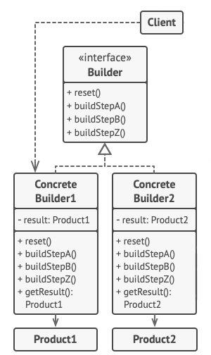
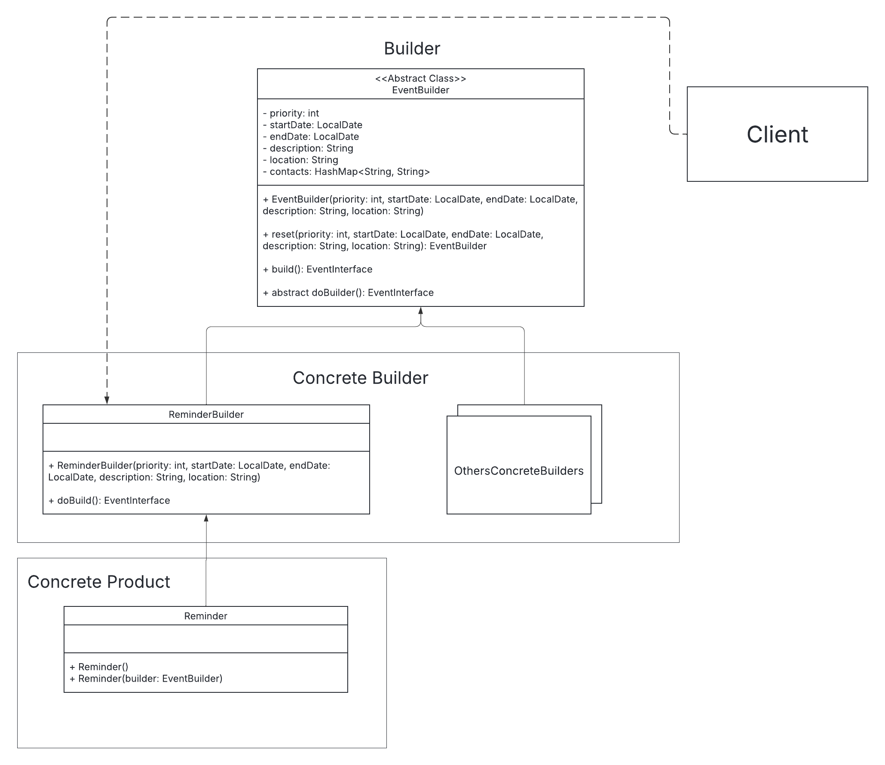
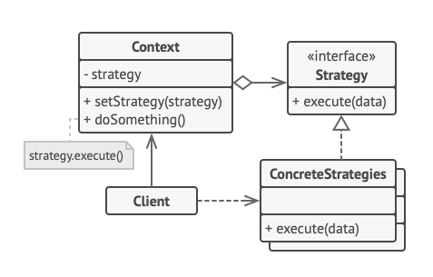
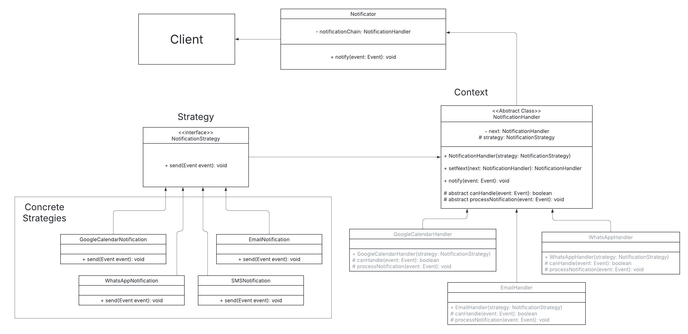
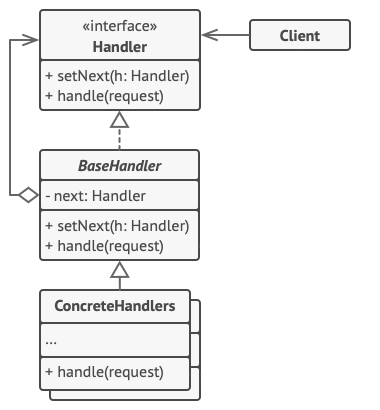
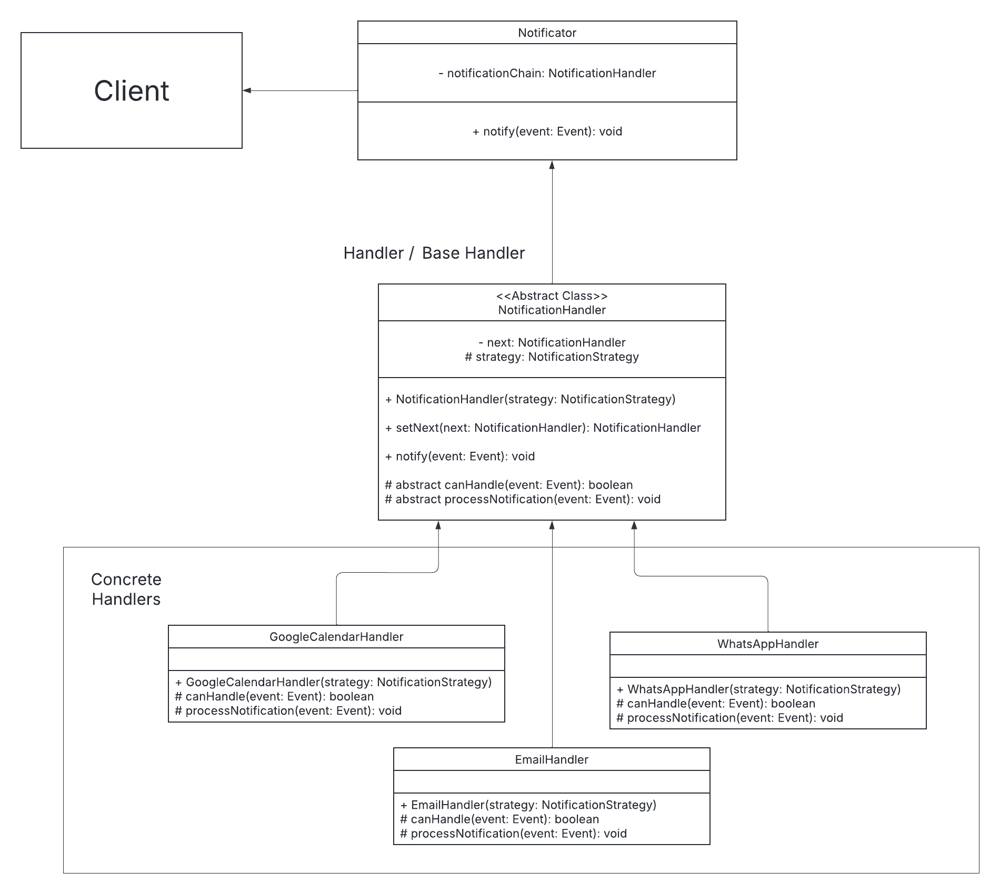
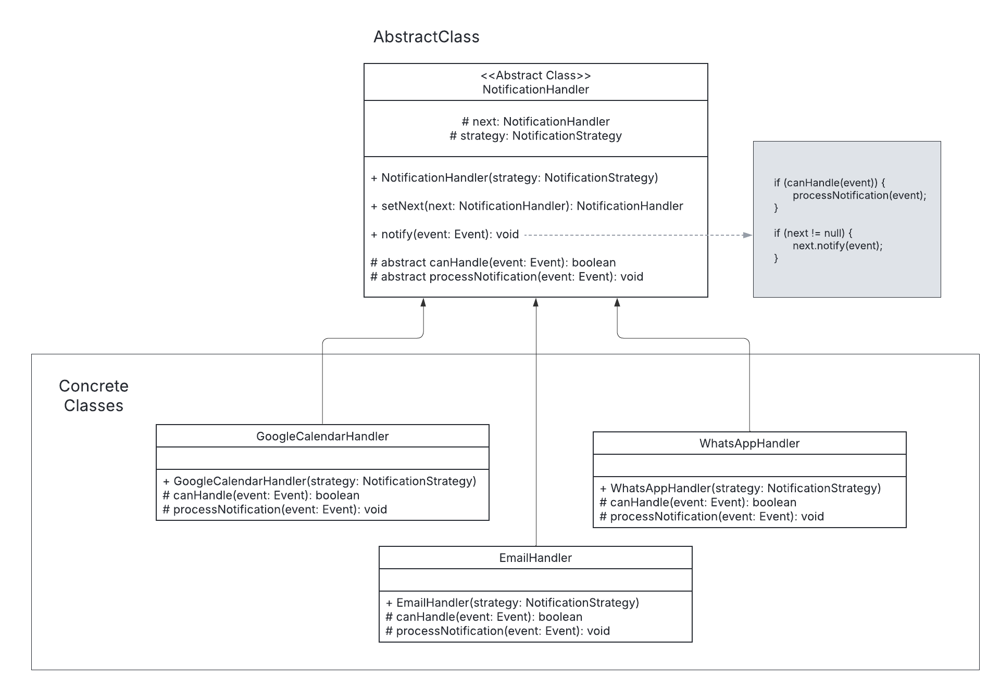
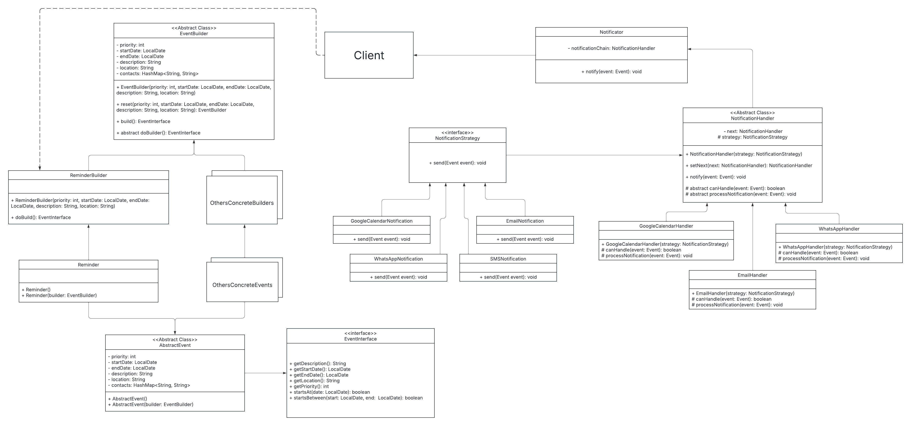

# Análise de Padrões de Projeto e Documentação

## Padrões Utilizados
- **Builder**
- **Strategy**
- **Chain of Responsability**
- **Template Method**

## 1. Builder Pattern

### Justificativa
- **Problema resolvido:** A criação de objetos que implementam a interface Event, pode envolver vários atributos obrigatórios e/ou opcionais.

- **Benefícios:**
  - Separa o processo de construção da representação final, tornando o código mais legível e fácil de manter.
  - Permite o reaproveitamento dos dados inseridos no builder para criar diferentes instâncias independentes.
  - Facilita a construção de objetos imutáveis ou sem a necessidade de múltiplos construtores.

### Classes Participantes
- **`EventBuilder` (abstrata):**
  - Contém os atributos e métodos comuns para construir um objeto do tipo evento (como prioridade, datas, descrição, localização e contatos).
  - Fornece métodos “fluent” para definir os valores e um método `build()` que delega a construção ao método abstrato `doBuild()`.
  
- **`ReminderBuilder` (concreta):**
  - Estende `EventBuilder` e implementa o método `doBuild()`, retornando uma instância de `Reminder`.
  - Permite a criação específica de um evento do tipo “Reminder”.

- **`AbstractEvent` e `EventInterface`:**
  - Representam a abstração do produto que está sendo construído.
  - `AbstractEvent` fornece implementações comuns, enquanto `EventInterface` define o contrato.

- **`Reminder`:**
  - Classe concreta que representa um tipo específico de evento, construído por meio do `ReminderBuilder`.

### Estrutura do Builder (sem diretor):
  

### Estrutura do Builder no Projeto:
  

---

## 2. Strategy Pattern

### Justificativa
- **Problema resolvido:** Diferentes métodos de notificação (email, WhatsApp, Google Calendar, SMS) possuem algoritmos distintos para o envio da mensagem, permitindo assumir uma estratégia diferente para cada tipo de notificação, de forma independente.

- **Benefícios:**
  - Encapsula cada algoritmo de envio em sua própria classe, permitindo a troca ou extensão dos métodos de notificação sem impactar o restante do código.
  - Promove a reutilização e a intercambialidade das estratégias de notificação.

### Classes Participantes
- **`NotificationStrategy` (interface):**
  - Define o método `send(EventInterface event)` que todas as estratégias de notificação devem implementar.

- **Implementações Concretas:**
  - **`EmailNotification`:**
    - Implementa o envio de notificações por email, extraindo o contato de email do evento.
  - **`GoogleCalendarNotification`:**
    - Implementa a notificação via Google Calendar, adicionando o evento ao calendário.
  - **`WhatsAppNotification`:**
    - Implementa a notificação via WhatsApp, enviando a mensagem para o número especificado.
  - **`SMSNotification`:**
    - Embora não seja diretamente utilizada na cadeia de handlers apresentada, está implementada para o envio de SMS.

- **Integração com os Handlers:**
  - Cada `NotificationHandler` possui uma referência a um objeto que implementa `NotificationStrategy` (por exemplo, o `EmailHandler` é construído com um `EmailNotification`), delegando assim o envio real da mensagem à estratégia configurada.

  ### Estrutura do Strategy:
    

  ### Estrutura do Strategy no Projeto:
    

---

## 3. Chain of Responsibility Pattern

### Justificativa
- **Problema resolvido:** Há a necessidade de selecionar dinamicamente o canal de notificação mais adequado para um evento, de acordo com critérios como prioridade e data.
- **Benefícios:**
  - Permite que múltiplos handlers tentem processar a notificação sem acoplamento rígido entre o remetente e os receptores.
  - Facilita a adição ou remoção de canais de notificação sem alterar a lógica central.

### Classes Participantes
- **`NotificationHandler` (abstrata):**
  - Define o método `notify(EventInterface event)` que verifica se o handler pode processar o evento (via `canHandle`) e, caso positivo, executa o processamento (via `processNotification`).
  - Contém um atributo `next` para apontar para o próximo handler na cadeia.

- **Handlers Concretos:**
  - **`GoogleCalendarHandler`:**
    - Inicialmente na cadeia, trata notificações (aqui, o método `canHandle` retorna `true` para todos os eventos, atuando como fallback).
  - **`WhatsAppHandler`:**
    - Processa eventos que atendem a condições específicas (por exemplo, prioridade igual a 10 e data atual).
  - **`EmailHandler`:**
    - Processa eventos com prioridade elevada ou que caem em um intervalo de datas definido.

- **`Notificator`:**
  - Classe responsável por montar a cadeia de responsabilidade.
  - Instancia os handlers e os encadeia (GoogleCalendarHandler → WhatsAppHandler → EmailHandler) para que, ao chamar `notify`, cada handler tenha a chance de processar o evento.

  ### Estrutura do CoR:
    

  ### Estrutura do CoR no Projeto:
    

---

## 4. Template Method Pattern

### Justificativa
- **Problema resolvido:** Necessidade de definir o esqueleto de um algoritmo para processamento de notificações, permitindo que subclasses alterem partes específicas desse algoritmo.

- **Benefícios:**
  - Evita a duplicação de código ao centralizar o fluxo de notificação na classe abstrata.
  - Permite que as subclasses redefinam apenas os passos necessários, mantendo a estrutura geral do algoritmo.
  - Facilita a extensibilidade da hierarquia de handlers.

### Classes Participantes
- **`NotificationHandler` (classe abstrata):**
  - Define o template method `notify(EventInterface event)` que implementa o algoritmo geral:
    1. Verifica se o handler pode processar o evento (`canHandle`)
    2. Se puder, processa a notificação (`processNotification`)
    3. Passa o evento para o próximo handler na cadeia (se existir)
  - Declara o método abstrato `canHandle(EventInterface event)` que subclasses devem implementar.
  - Fornece uma implementação padrão para `processNotification(EventInterface event)` que pode ser sobrescrita.

- **Implementações Concretas:**
  - **`GoogleCalendarHandler`:**
    - Implementa `canHandle()` para determinar se deve processar a notificação (neste caso, aceita todos os eventos).
    - Sobrescreve `processNotification()` para adicionar formatações específicas para Google Calendar.
  
  - **`WhatsAppHandler`:**
    - Implementa `canHandle()` para processar apenas eventos com prioridade 10 que começam na data atual.
    - Sobrescreve `processNotification()` para formatar a mensagem para WhatsApp.
  
  - **`EmailHandler`:**
    - Implementa `canHandle()` para processar eventos de alta prioridade ou que estejam em um período específico.
    - Sobrescreve `processNotification()` para formatar a mensagem para email.

### Estrutura do Template Method:
  

### Estrutura do Template Method no Projeto:
  

---

## Estrutura Completa:
  

## Considerações Finais

A combinação desses quatro padrões (Builder, Chain of Responsibility, Strategy e Template Method) proporciona uma arquitetura modular, flexível e de fácil manutenção:

- **Builder Pattern:** Simplifica a criação de objetos complexos com múltiplos parâmetros, evitando a proliferação de construtores e facilitando o reaproveitamento do builder.
- **Chain of Responsibility Pattern:** Permite a distribuição das responsabilidades de notificação por diferentes canais, com cada handler avaliando se pode processar o evento, sem conhecimento dos demais.
- **Strategy Pattern:** Isola os algoritmos de envio de notificações, tornando possível a adição ou substituição de canais sem a necessidade de alterar a lógica dos handlers.
- **Template Method Pattern:** Define o esqueleto do algoritmo de notificação, permitindo que as subclasses alterem partes específicas sem modificar a estrutura geral, promovendo reutilização de código e consistência no fluxo de processamento.

Essa estrutura não apenas resolve os problemas atuais do sistema de notificação, mas também fornece uma base sólida para extensões e modificações futuras, seguindo os princípios de design orientado a objetos.

